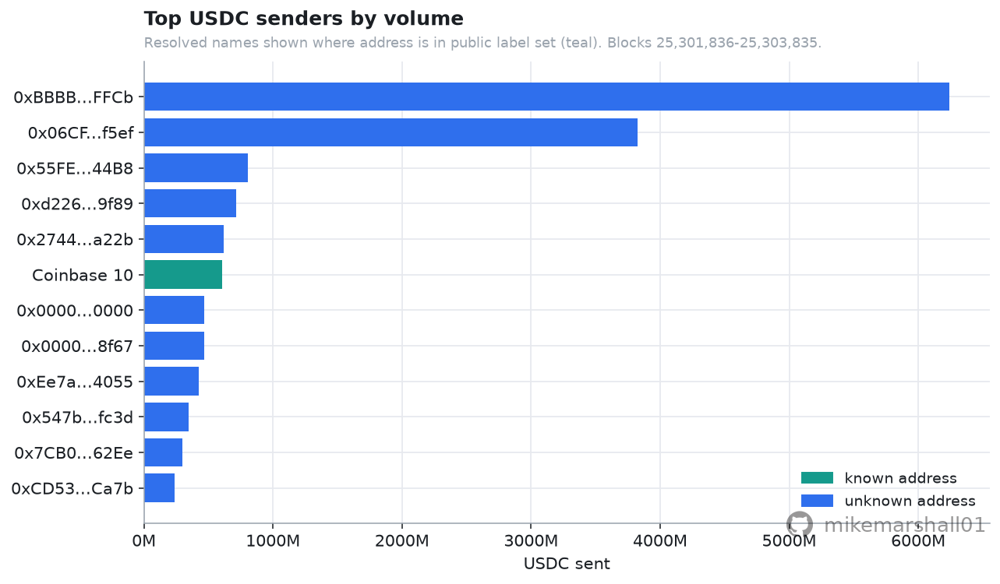
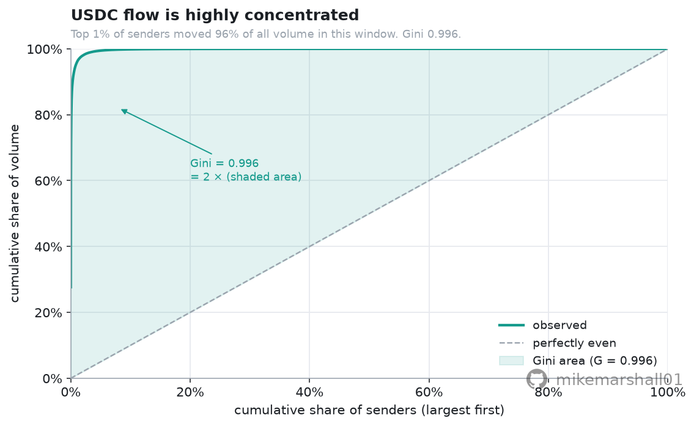
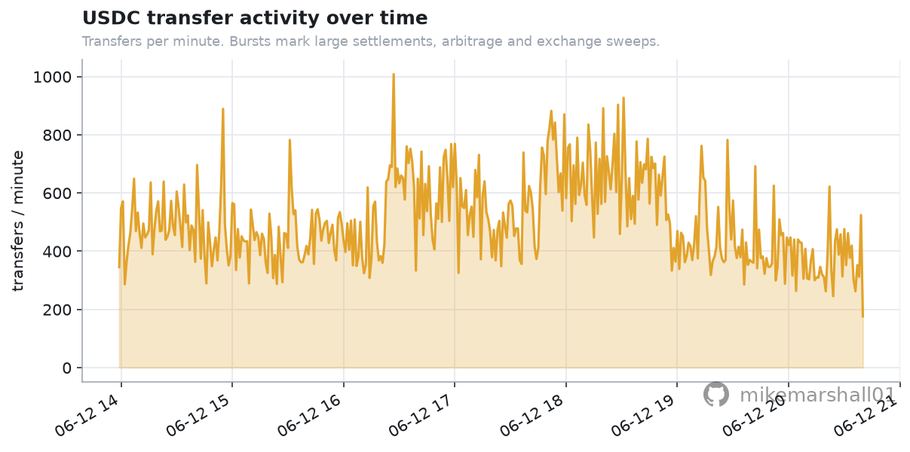
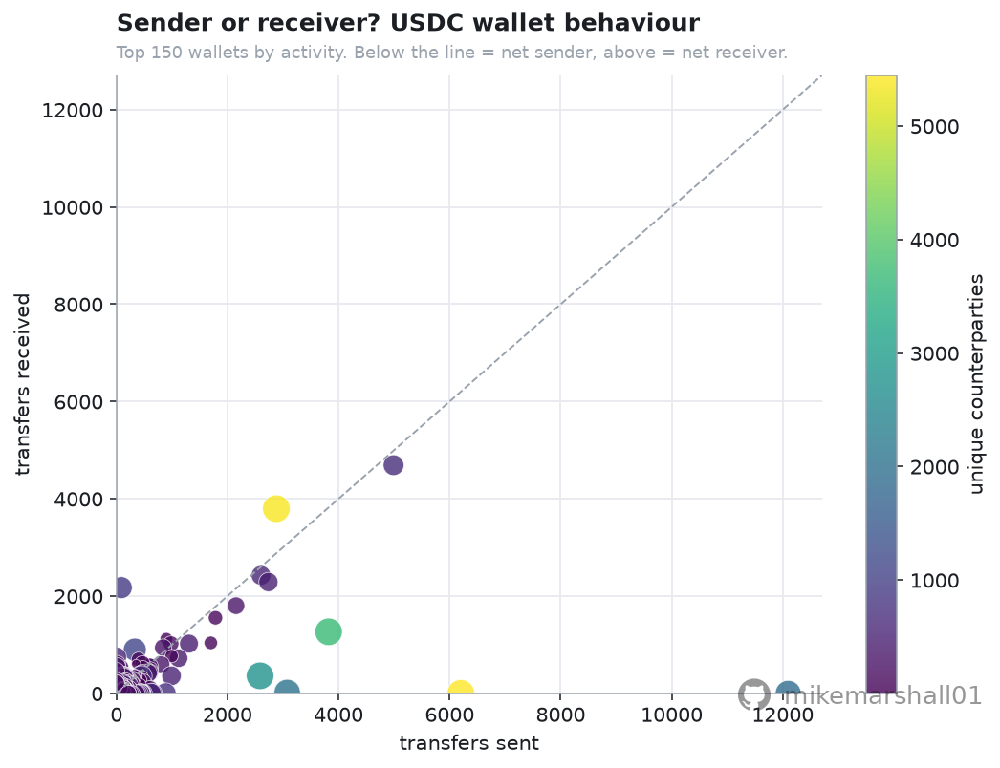

# Wallet Intelligence: On-Chain Data Engineering from Raw Logs

A hands-on, **free-data** walkthrough of reading Ethereum directly off the chain: connect to
a public node, find and **decode** ERC-20 `Transfer` events with their ABI, build a
per-wallet feature table from scratch, and draw a few honest pictures of who moves a token
and how concentrated that activity is. Written to be read as much as run.

Built on a **free, keyless public JSON-RPC** endpoint with **no API key required**. Part of a
wider crypto-quant handbook; this is the on-chain data-engineering repo.

---

## What you will learn

| Concept | What it is | Where |
|---|---|---|
| **Blocks, transactions, logs, events** | how on-chain activity is actually structured, and why *logs* are the workhorse of analytics | §1 |
| The **event signature** (`topic0`) | the Keccak fingerprint every standard token writes, so you can find transfers for *any* ERC-20 without its ABI | §1 |
| `eth_getLogs` | the one filtered query the whole pipeline rests on, paginated safely for free nodes | §2 |
| **ABI decoding** | pulling `from` / `to` out of indexed topics and `value` out of the data blob, by hand and with web3 | §2 |
| A **per-wallet feature table** | collapsing transfer *edges* into one row per wallet: counts, volume, counterparties, lifespan, net flow | §3 |
| **Holder concentration** | a Lorenz-style curve and a one-number summary of how few addresses move most of the token | §4 |
| **Behavioural views** | top senders, an activity heartbeat, and a sender-vs-receiver scatter that hints at wallet *roles* | §4 |

Every one of these carries straight over to any token, any event, and any wider block range.

## Example output

The notebook follows **USDC** over a small recent window (~2000 blocks, about 6-7 hours of
Ethereum), decodes every `Transfer` event, and builds the wallet table. A typical run decodes
around **200,000 transfers** across roughly **70,000 distinct wallets**, and finds the flow to
be **extremely concentrated**: the **top 1% of senders moved ~96% of all volume**, and the
**top 10 senders alone moved ~64%**.

| | |
|---|---|
|  |  |
|  |  |

> The headline is a **real, modest, single-window** measurement, not a sweeping claim about
> the token. The notebook is explicit about what a few hours of one token can and cannot tell
> you, and how you would widen it.

## Data

- **Source:** Ethereum mainnet via a **free, keyless public JSON-RPC** endpoint. The helper
  tries `https://ethereum-rpc.publicnode.com`, then `https://cloudflare-eth.com`, then
  `https://rpc.ankr.com/eth` (then a further fallback), and uses the first that answers. No
  account, no API key, no paid feed.
- **How much you need:** a *small, recent* block range is enough to learn everything here.
  USDC is busy enough that ~2000 blocks already yields ~200k transfers. We keep the window
  small so the whole notebook runs in a couple of minutes and stays polite to a free node.
- The fetcher pulls and decodes the logs once and **caches the result to `data/` as Parquet**,
  so re-runs are instant and work offline after the first fetch.
- An optional `ETHERSCAN_API_KEY` is noted for fetching verified ABIs or longer history, but
  **nothing in this repo requires it** — the `Transfer` signature is a fixed standard, so we
  decode it ourselves.

## Run it

```bash
git clone <this-repo> && cd wallet-intelligence
python3 -m venv .venv && source .venv/bin/activate
pip install -r requirements.txt

# If `python -m venv` reports "ensurepip is not available" (some minimal Ubuntu/WSL setups),
# either install the venv package once:   sudo apt install -y python3-venv python3-pip
# or bootstrap pip into the venv:          curl -sS https://bootstrap.pypa.io/get-pip.py | .venv/bin/python

# No API key needed. (An optional ETHERSCAN_API_KEY can be set in .env; copy .env.example.)

# Option A: open the notebook
jupyter notebook notebooks/01_wallet_intelligence.ipynb

# Option B: re-run headless from the .py source (jupytext keeps the .py and .ipynb in sync)
jupytext --to notebook notebooks/01_wallet_intelligence.py
jupyter nbconvert --to notebook --execute --inplace notebooks/01_wallet_intelligence.ipynb
```

## Structure

```
wallet-intelligence/
├── notebooks/
│   └── 01_wallet_intelligence.ipynb   # the walkthrough (executed, charts inline)
│   └── 01_wallet_intelligence.py      # same notebook as a readable .py (jupytext)
├── src/
│   ├── data.py     # keyless public-RPC helpers: connect, get_logs, decode_transfers, cache
│   └── style.py    # shared house chart style (consistent look across the handbook)
├── assets/         # rendered charts (committed, so they show in this README)
├── data/           # cached Parquet of decoded logs (gitignored, re-fetched on first run)
├── requirements.txt
└── .env.example
```

## Caveats

This is an **educational** example, not a production analytics pipeline and not financial
advice. The notebook is explicit about its limits: the window is only a few hours of one
token, so it describes *this slice*, not the token's long-run distribution; an "address" is
not an identity, and the busiest ones are almost all contracts (exchange hot wallets, bridges,
routers) rather than people; `Transfer` events miss internal transfers, approvals and the
*intent* behind a move; and free public nodes rate-limit and cap log ranges, so heavy work
wants your own node or an archive provider. The decoding and feature-engineering pattern,
though, is exactly the one used at scale.

## Licence

MIT.
